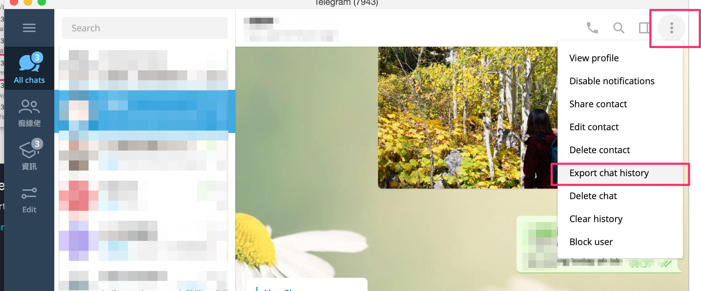
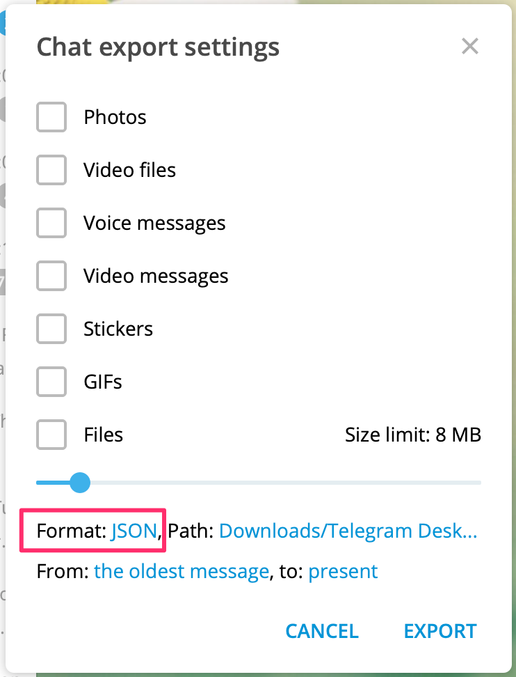

# Telegram Word Cloud 繁體中文

> I just want to know how my gf and I speaks during Telegram chat

## Get started (Python)

### Install dependencies
```bash
# pyenv https://python-poetry.org/docs/managing-environments/
# so whenever we run `poetry add xxx`, they are added to the python shell we want
# then we select the shell from vscode ipynb playbook
# brew install pyenv # optional, we just need to install the predefined python version from poetry's config

# Poetry: https://python-poetry.org/docs/basic-usage/
pip3 install poetry # poetry = npm, and we want to use python3
poetry config virtualenvs.in-project true # install to local node_modules, so the python shell can be detected by vscode
poetry install # install from Pipfile
```

### Select the correct python interactive shell

> Select the one where `site_packages` are installed in


## Data preparation - Export Telegram Chat History

1. Export Telegram as json using Telegram Desktop (not Telegram Mac)
  - [Telegram Desktop](https://desktop.telegram.org/) is needed because it's different from Telegram Mac
  - 
  - 